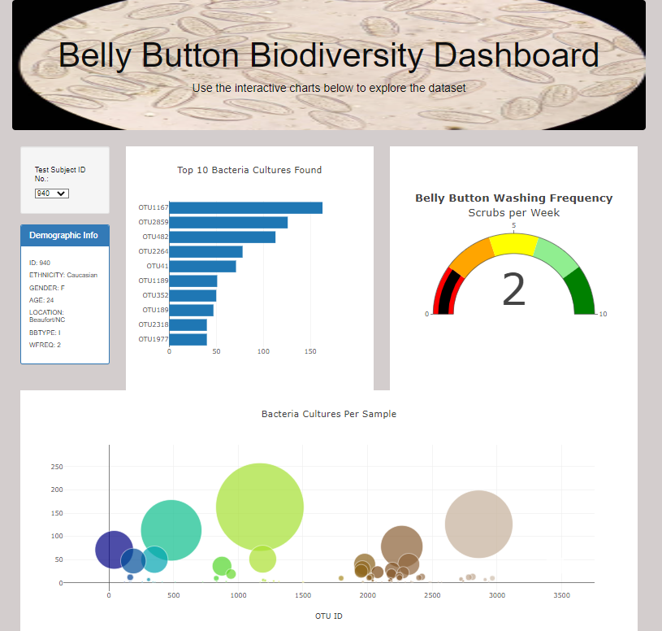

# Belly Button Bacteria Analysis

## Overview

The goal of the Belly Button Biodiviersity analysis was to produce different sets of graphs and charts to help understand data that was being collected. Bacteria samples from thousands of subjects were collected in order to determine if a new bacteria used to create their "beef" is found in the navel of humans. The desired outcome was something that could be easily read by anyone who would want to see the results of the data. 

## Analysis

In order to provide such an ask, first we needed to navigate through the JSON data and extract the information we needed to create the graphs. Then the data would need to be produced in a manner that was inviting and easily legible to most people. Creating an HTML using JS and D3 would provide the best way to express the results.

Keeping the volunteers personal information was the most important, so names were removed and ID numbers were used. A bar graph, bubble chart, and gauge were created with the given information. 

## Summary

The Belly Button Biodiversity Dashboard was created that showed all 3 charts for any given volunteers sample. It was created to be dynamic. Specifically, the data can be filtered by volunteer, from there you can identify the top 10 individual bacteria that are living in this subjects navel. Furthermore, you can determine all of the bacteria cultures per sample. Finally a gauge that showed how often the subject would wash their navel. An image of the dashboard is below.

If you would like to try out the dashboard for youself, you can visit the site live [HERE](https://kmomolina.github.io/Belly_Button_Plotly/)